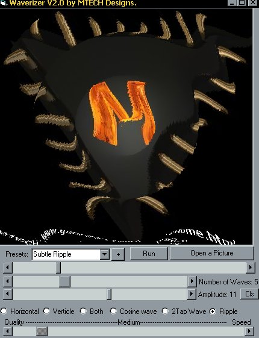



## Real Time Image Ripple\!\!\!

### Description

From the Author of Real Time Picture Distortion, Comes (drum roll please...) Version 2!!!!

6 Times as much fun as version 1. Now with Two-Tap Sinusiodal Image Distortion, Ripple generation, Presets, Horizontal and Verticle wave orientaions, Real time quality-verses-speed control, Automatic playback and On-The-Fly Picture loading! All this at the same blistering speed of version 1 (conditions do apply)!

Expert or Newbie you have GOT to see this!

(and rate it, and visit my web site, and comment on it, etc.) Click Here NOW
 
### More Info
 

             |
---                |---
**Submitted On**   |2000-06-24 14:51:04
**By**             |[Michael Pote](https://github.com/Planet-Source-Code/PSCIndex/blob/master/ByAuthor/michael-pote.md)
**Level**          |Advanced
**User Rating**    |5.0 (35 globes from 7 users)
**Compatibility**  |VB 4\.0 \(32\-bit\), VB 5\.0, VB 6\.0
**Category**       |[Custom Controls/ Forms/  Menus](https://github.com/Planet-Source-Code/PSCIndex/blob/master/ByCategory/custom-controls-forms-menus__1-4.md)
**World**          |[Visual Basic](https://github.com/Planet-Source-Code/PSCIndex/blob/master/ByWorld/visual-basic.md)
**Archive File**   |[CODE\_UPLOAD70926242000\.zip](https://github.com/Planet-Source-Code/michael-pote-real-time-image-ripple__1-9215/archive/master.zip)

